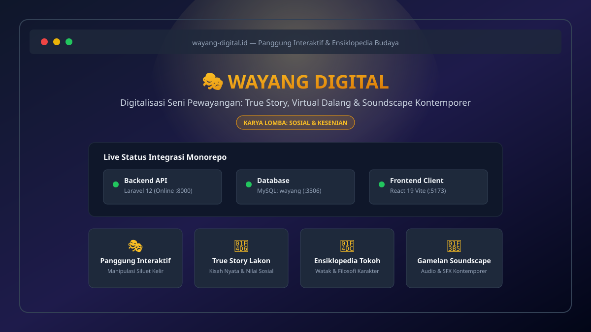

# 🎭 Wayang Digital — Platform Interaktif Digitalisasi Pewayangan

> 🏆 **KARYA INOVASI LOMBA**  
> **Tema Utama:** Sosial dan Kesenian  
> **Sub-Tema:** Revitalisasi Budaya Tradisional Berbasis Digital & Gamifikasi Interaktif

[](https://laravel.com)
[-61DAFB?style=for-the-badge&logo=react&logoColor=black)](https://react.dev)
[](https://mysql.com)
[](LICENSE)

---

## 📸 Preview Aplikasi


---

## 📌 Latar Belakang & Nilai Inovasi

### 1. Masalah Sosial Budaya
Kesenian wayang kulit sarat akan nilai luhur, etika sosial, dan filosofi hidup bangsa. Namun, bagi generasi muda (*Gen Z*), pertunjukan wayang konvensional kerap dianggap membosankan (*boring*) akibat:
- **Durasi Terlalu Panjang:** Semalam suntuk (7–8 jam non-stop).
- **Hambatan Bahasa:** Penggunaan bahasa kawi/jawa kuno yang sulit dipahami secara intuitif oleh masyarakat awam.
- **Komunikasi Satu Arah:** Minimnya interaksi langsung antara penonton dengan lakon yang dibawakan.

### 2. Solusi & Inovasi (Digitalisasi, Edukasi, & Gamifikasi)
**Wayang Digital** mentransformasikan kesenian adiluhung ini ke dalam panggung digital interaktif (*Virtual Kelir*) dua arah:
- **Edukasi Berbasis Nilai (*True Story*):** Mengemas lakon pewayangan melalui kisah nyata dan isu-isu sosial kontemporer (kejujuran, kepedulian sosial, keadilan) yang *relatable* bagi generasi muda.
- **Panggung Interaktif (*Virtual Dalang*):** Pengguna dapat memegang kendali atas tokoh wayang secara mandiri melalui simulasi gerak dan sendi digital.
- **Gamifikasi Kultural:** Eksplorasi ensiklopedia karakter berhadiah lencana watak dan tantangan peragaan adegan.
- **Atmosfer Kontemporer:** Perpaduan pencahayaan blencong digital, siluet kelir modern, dan aransemen *soundscape* gamelan kontemporer.

---

## 🌟 Fitur Utama Platform
1. **🎭 Panggung Interaktif (*Virtual Stage*):** Kanvas digital manipulasi siluet tokoh wayang di atas kelir dengan responsivitas realtime.
2. **📖 Alur Kisah Nyata (*True Story Mode*):** Penyajian lakon adaptasi kisah sosial per adegan dengan narasi visual dan dialog modern.
3. **📜 Ensiklopedia Tokoh & Filosofi:** Katalog tokoh perwayangan lengkap dengan deskripsi watak, senjata, filosofi moral, dan peran sosialnya.
4. **🎵 Soundscape & SFX Gamelan:** Pengatur tata suara atmosferik (suluk dalang, dodogan kotak, kepyak, dan instrumen gamelan dinamis).
5. **⚡ RESTful API Engine:** Arsitektur backend mandiri berbasis Laravel 12 untuk sinkronisasi data karakter, naskah lakon, dan autentikasi pengguna.

---

## 🏛️ Arsitektur Sistem & Tech Stack

```text
[ Browser / Klien Web ]
        │
        │ HTTP REST API (CORS Terproteksi)
        ▼
[ Frontend: React 19 + Vite (Port 5173) ]
        │
        │ Axios API Service
        ▼
[ Backend: Laravel 12 API (Port 8000) ]
        │
        │ PDO Connection (Driver Database)
        ▼
[ Database: MySQL 'wayang' (Port 3306 - XAMPP) ]
```

- **Backend**: Laravel 12 (RESTful API, Sanctum, CORS middleware terisolasi, Eloquent ORM).
- **Frontend**: React 19, Vite bundler, Axios API Service, CSS Custom Responsive Theme.
- **Database**: MySQL (Database name: `wayang`, driver `database` untuk session, cache, dan queue).
- **Format Repositori**: Clean Monorepo terisolasi (`be/` dan `fe/`).

---

## 📁 Struktur Monorepo

```text
wayang/
├── be/                                # Backend API (Laravel 12)
│   ├── app/Http/Controllers/Api/      # Endpoint Controllers (StatusController, dll)
│   ├── config/cors.php                # Konfigurasi CORS terproteksi
│   ├── database/migrations/           # Skema tabel database (users, sessions, cache, jobs)
│   ├── database/seeders/              # Seeder akun demo & master data
│   ├── routes/api.php                 # Rute REST API
│   ├── storage/app/public/            # Penyimpanan dinamis (aset wayang & audio)
│   ├── .env.example                   # Template konfigurasi environment aman
│   └── composer.json
│
├── fe/                                # Frontend UI (React 19 + Vite)
│   ├── public/audio/                  # Aset soundtrack (bgm) & efek suara (sfx)
│   ├── public/images/                 # Aset grafis kelir & karakter wayang
│   ├── src/features/stage/            # Modul Panggung Interaktif & Puppeteering
│   ├── src/features/story/            # Modul Lakon & Presentasi True Story
│   ├── src/features/encyclopedia/     # Modul Ensiklopedia Tokoh & Filosofi
│   ├── src/services/api.js            # Axios client penghubung ke Laravel
│   ├── .env.example                   # Template variabel lingkungan frontend
│   └── package.json
│
├── docs/screenshots/                  # Aset visual & dokumentasi preview
├── .gitignore                         # Proteksi zero-trust root monorepo
├── LICENSE                            # MIT License
└── README.md                          # Dokumentasi resmi proyek
```

---

## ⚙️ Prasyarat Sistem (Prerequisites)
Sebelum menjalankan proyek, pastikan perangkat telah terinstal:
- **PHP**: Versi `>= 8.2` (Direkomendasikan PHP 8.2 atau 8.3 via XAMPP)
- **Composer**: Versi `>= 2.2`
- **Node.js**: Versi LTS (`>= 20.x`) & `npm`
- **MySQL Database Server**: Port 3306 (melalui XAMPP Control Panel)

---

## 🚀 Panduan Instalasi & Menjalankan Proyek (Windows / XAMPP)

### Langkah 1: Persiapan Database
1. Buka **XAMPP Control Panel**, lalu klik tombol **Start** pada modul **Apache** dan **MySQL**.
2. Buka browser dan akses: `http://localhost/phpmyadmin`
3. Buat database baru bernama: **`wayang`** (Collation: `utf8mb4_unicode_ci`).

---

### Langkah 2: Setup Backend (`be/`)
Buka terminal dan jalankan urutan perintah berikut:

```powershell
# 1. Pindah ke direktori backend
cd be

# 2. Unduh dependensi backend
composer install

# 3. Salin konfigurasi environment dari template aman
copy .env.example .env

# 4. Generate application key
php artisan key:generate

# 5. Eksekusi migrasi tabel & seeder awal (WAJIB!)
php artisan migrate --seed

# 6. Hubungkan direktori storage publik
php artisan storage:link

# 7. Jalankan server lokal Laravel
php artisan serve
```

> ⚠️ **PENTING:** Perintah `php artisan migrate --seed` **WAJIB** dijalankan karena sistem menggunakan driver `database` untuk pengelolaan session, cache, dan queue, serta untuk mengaktifkan akun demo juri.
> 
> Server backend akan aktif di: **`http://127.0.0.1:8000`**  
> Verifikasi status koneksi: **`http://127.0.0.1:8000/api/status`**

---

### Langkah 3: Setup Frontend (`fe/`)
Buka tab terminal baru:

```powershell
# 1. Pindah ke direktori frontend
cd fe

# 2. Unduh dependensi frontend
npm install

# 3. Salin konfigurasi environment dari template aman
copy .env.example .env

# 4. Jalankan development server
npm run dev
```

> Buka aplikasi di browser: **`http://localhost:5173`**  
> Indikator panggung pewayangan akan langsung mendeteksi koneksi aktif ke Laravel API dan database MySQL `wayang`.

---

## 👤 Akun Uji Coba & Alur Demo untuk Juri

### Kredensial Demo (Otomatis dibuat oleh `php artisan migrate --seed`):
- **Email:** `demo@wayangdigital.id`
- **Password:** `Wayang@2026!`
- **Role:** Dalang Penguji (Juri)

### Alur Singkat Evaluasi Juri:
1. Akses halaman muka di `http://localhost:5173`.
2. Perhatikan kartu **Status Integrasi API & Database** (Memastikan respon hijau: Backend Online & MySQL `wayang` Connected).
3. Klik tombol **🔄 Cek Ulang Koneksi** untuk memverifikasi handshake reaktif antara React dan Laravel 12.
4. Eksplorasi fondasi arsitektur modular: Panggung Interaktif (`features/stage`), True Story Lakon (`features/story`), dan Ensiklopedia (`features/encyclopedia`).

---

## 🛠️ Panduan Troubleshooting

| Masalah / Kendala | Penyebab Umum | Solusi Cepat |
| :--- | :--- | :--- |
| **Tabel `sessions` tidak ditemukan** | `php artisan migrate` belum dijalankan setelah ganti `.env`. | Jalankan `cd be && php artisan migrate` di terminal. |
| **CORS Error di Console Browser** | Port frontend berbeda dari konfigurasi `be/.env`. | Pastikan `FRONTEND_URL=http://localhost:5173` di `be/.env` atau tambahkan port Anda ke `CORS_ALLOWED_ORIGINS`. |
| **Port 8000 / 5173 Bentrok** | Port sedang dipakai proses background lain. | Jalankan backend di port lain: `php artisan serve --port=8080`, lalu sesuaikan `VITE_API_URL` di `fe/.env`. |
| **`No application encryption key has been specified`** | File `.env` belum memiliki `APP_KEY`. | Jalankan `cd be && php artisan key:generate`. |
| **MySQL Connection Refused (3306)** | Layanan MySQL di XAMPP belum aktif. | Buka XAMPP Control Panel, pastikan tombol **Start** pada MySQL sudah menyala hijau. |

---

## 👥 Tim Pengembang
- **Ketua Tim / Lead Developer:** Ahmad Fayyadh Fadhil
- **Creative & Cultural Content:** Tim Wayang Digital
- **Tema Lomba:** Sosial dan Kesenian (Digitalisasi Warisan Budaya)

---

## 📄 Lisensi
Proyek ini didistribusikan di bawah lisensi resmi terbuka [MIT License](LICENSE).  
Hak cipta © 2026 Ahmad Fayyadh Fadhil & Tim Wayang Digital.
